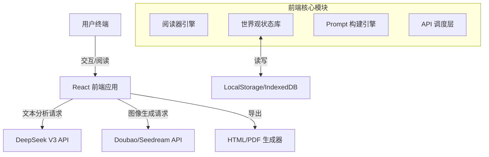

# 智绘阅读 (AI Reading Companion) 深度项目计划书

**版本**: 1.1.0  
**日期**: 2026-01-31  
**状态**: 进行中 (In Progress)  
**作者**: 智绘阅读开发团队

---

## 目录

1.  [项目概况](#1-项目概况)
    *   1.1 项目背景与市场分析
    *   1.2 用户痛点
    *   1.3 项目愿景与目标
    *   1.4 核心价值主张
2.  [产品详细功能规范](#2-产品详细功能规范)
    *   2.1 沉浸式智能阅读器
    *   2.2 动态世界观（设定库）系统
    *   2.3 智能生图与编辑引擎
    *   2.4 多格式导出与分享
3.  [技术架构与实施方案](#3-技术架构与实施方案)
    *   3.1 总体架构设计
    *   3.2 前端工程化方案
    *   3.3 AI 服务层设计
    *   3.4 数据模型与存储
4.  [AI 工程化与算法策略](#4-ai-工程化与算法策略)
    *   4.1 结构化叙事分析管线
    *   4.2 视觉一致性控制算法
    *   4.3 Prompt Engineering 策略
5.  [项目管理与实施排期](#5-项目管理与实施排期)
    *   5.1 阶段一：基础设施与 MVP
    *   5.2 阶段二：核心差异化构建（当前）
    *   5.3 阶段三：体验升级与移动端
    *   5.4 阶段四：生态化与商业化
6.  [风险评估与应对](#6-风险评估与应对)
7.  [测试与质量保证](#7-测试与质量保证)

---

## 1. 项目概况

### 1.1 项目背景与市场分析
随着 AIGC（人工智能生成内容）技术的爆发，传统的数字阅读行业正面临着从“纯文本”向“多模态”转型的巨大机遇。目前的阅读市场主要分为两类：
1.  **传统电子书/网文平台**：以文字为主，想象力完全依赖读者脑补，缺乏视觉冲击力。长篇阅读容易产生疲劳感。
2.  **漫画/条漫平台**：视觉体验好，但生产成本高，更新速度慢，无法覆盖海量的小说内容。

市场上缺乏一种能够**实时**将海量存量文字内容转化为高质量视觉体验的工具。现有的 AI 绘画工具（如 Midjourney, Stable Diffusion）虽然强大，但门槛较高，且难以理解长篇小说的上下文连续性（Context Consistency），导致生成的角色形象不统一，无法形成连贯的叙事。

### 1.2 用户痛点
*   **想象力匮乏**：在阅读科幻、奇幻或硬科普类作品时，读者往往难以在脑海中构建出准确的画面（例如“戴森球的结构”、“克苏鲁风格的怪物”）。
*   **角色崩坏**：使用普通 AI 工具辅助阅读时，同一个角色在第一章和第十章长相完全不同，严重破坏沉浸感。
*   **创作门槛高**：许多网文作者希望为自己的作品制作插图或周边，但约稿画师成本高昂（单张 500-2000 元），且沟通周期长。
*   **碎片化阅读**：现代人注意力难以长时间集中在纯文本上，需要视觉刺激来维持阅读兴趣。

### 1.3 项目愿景与目标
**愿景**：让每一次阅读都成为一场“所见即所读”的视觉盛宴。

**核心目标**：
1.  **自动化**：实现从文本到插图的全自动流水线，将插图生产成本降低至接近于零。
2.  **一致性**：解决 AI 叙事生图中的“角色一致性”这一世界级难题，确保人物、场景在长篇幅中保持稳定。
3.  **产品化**：将复杂的 Prompt 工程和模型调用封装在极其简单的 UI 背后，用户只需“点击”或“翻页”即可。

### 1.4 核心价值主张
*   **对于读者**：提供超越纸质书和传统电子书的沉浸式体验，让阅读变得像看电影一样。
*   **对于作者**：提供低成本的 IP 视觉化工具，快速验证角色设计和场景概念。
*   **对于教育**：将枯燥的科普文章转化为生动的图文绘本，提高学习效率。

---

## 2. 产品详细功能规范

### 2.1 沉浸式智能阅读器 (Immersive Reader)
这是用户停留时间最长的核心界面。
*   **文本渲染**：
    *   支持 `.txt` 文件的高性能解析与分页。
    *   自定义排版引擎：支持字体切换（宋/黑/楷）、字号调节、行间距调节、背景色护眼模式（羊皮纸、夜间模式）。
*   **智能交互**：
    *   **AI 锚点推荐**：系统自动分析当前页面的文本，计算“画面感指数”，在适合生图的段落旁显示魔法棒图标。
    *   **手动触发**：用户可选中任意段落，点击“为此段生图”。
*   **阅读流体验**：
    *   插图生成后自动嵌入段落之间，不打断阅读视线。
    *   图片支持点击放大查看大图，并显示 AI 提取的“场景分析”元数据（如：氛围：压抑；光影：侧逆光）。

### 2.2 动态世界观（设定库）系统 (Worldview System)
这是本项目的核心差异化功能，用于管理故事的“记忆”。
*   **角色卡 (Character Cards)**：
    *   **属性**：姓名、性别、年龄、外貌描述（Prompt）、性格特征。
    *   **视觉锚点**：支持上传或生成一张“标准立绘”。系统会提取该立绘的特征（Embedding），在后续生图中作为 Reference。
    *   **锁定机制**：用户可以“锁定”某个角色的形象，防止被 AI 自动更新覆盖。
*   **场景卡 (Location Cards)**：
    *   管理核心地点（如：霍格沃茨大厅、贝克街221B）的环境描述。
    *   支持为特定地点绑定特定的氛围词（如：赛博朋克、维多利亚风格）。
*   **自动扫描与发现 (Auto-Discovery)**：
    *   阅读新章节时，后台静默运行分析任务。
    *   若发现新登场角色（且不在库中），弹出“新世界观发现”提示，建议用户建立档案。
    *   支持一键为缺失形象的角色生成初始立绘。

### 2.3 智能生图与编辑引擎
*   **多模式生图**：
    *   **叙事模式**：严格遵循原文描写，强调动作和互动。
    *   **写真模式**：忽略部分背景，重点展现角色美感。
    *   **科普模式**：针对非虚构内容，增强对物理规律和科学设定的还原度。
*   **风格控制器**：
    *   预设风格库：水墨风、皮克斯3D、日系二次元、美漫风格、写实电影感。
    *   自定义 Prompt：允许高级用户在预设基础上追加 Lora 或特定词汇。
*   **图片编辑**：
    *   **重绘 (Regenerate)**：不满意当前结果，一键重新生成。
    *   **微调 (In-painting)**：(规划中) 选中图片特定区域（如手部），通过文字指令修复。

### 2.4 多格式导出与分享
*   **HTML 视觉小说**：
    *   打包所有文本、图片、样式为一个独立的 `.html` 文件。
    *   支持离线在任何浏览器中打开，保留翻页效果。
*   **PDF 绘本**：
    *   自动排版：左图右文，或上图下文。
    *   打印级清晰度：图片自动提升分辨率。
*   **社交分享卡片**：
    *   生成包含“金句 + 插图 + 二维码”的精美卡片，利于在微信/朋友圈传播。

---

## 3. 技术架构与实施方案

### 3.1 总体架构设计
项目采用 **CSR (Client-Side Rendering)** 架构，最大化利用用户终端算力进行文本解析和渲染，后端仅作为 AI 能力的 Proxy。



### 3.2 前端工程化方案
*   **框架**：React 19
    *   利用 React 19 的 `use` Hook 和 Server Actions (未来扩展) 特性。
    *   使用 Context API 进行全局状态管理（UserSettings, WorldviewData）。
*   **构建工具**：Vite 6
    *   秒级热更新 (HMR)，确保开发体验。
    *   Rollup 打包优化，实现代码分割 (Code Splitting)。
*   **样式方案**：Tailwind CSS
    *   Utility-first CSS，快速构建响应式 UI。
    *   自定义 `tailwind.config.js` 配置项目的品牌色系 (Brand Colors)。
*   **类型系统**：TypeScript 5
    *   全量类型覆盖，确保 `NarrativeFacts`、`VisualSpec` 等核心数据结构的严谨性。

### 3.3 AI 服务层设计
*   **文本智能 (Logic Brain)**：
    *   **Model**: DeepSeek V3 (via Volcengine)
    *   **Role**: 负责理解复杂的文学语言，提取结构化数据。
    *   **Fallback**: 预留 Google Gemini Flash 作为备用线路，提高可用性。
*   **视觉智能 (Visual Engine)**：
    *   **Model**: Doubao-Seedream (字节跳动豆包模型)
    *   **Capabilities**: 优秀的中文理解能力，支持 Reference Image (图生图) 控制。
    *   **Optimization**: 针对 16:9 (电影感) 和 1:1 (头像) 预设不同的分辨率参数。

### 3.4 数据模型与存储
核心数据结构定义 (TypeScript Interface):

```typescript
// 世界观：角色
interface Character {
  id: string;
  name: string;
  description: string; // 原始描述
  visualSummary: string; // AI提炼的视觉特征 (e.g. "银发红瞳，身穿黑色风衣")
  imageUrl?: string;   // 标准立绘 URL
  locked: boolean;     // 是否锁定形象
}

// 叙事事实 (LLM 分析结果)
interface NarrativeFacts {
  characters: string[]; // 本段落出场的角色名列表
  location: string;     // 当前地点
  action: string;       // 发生的动作
  mood: string;         // 氛围
  objects: string[];    // 关键物品
}

// 书籍元数据
interface Book {
  id: string;
  title: string;
  content: string;
  chapters: Chapter[];
  worldviewId: string; // 关联的世界观 ID
}
```

---

## 4. AI 工程化与算法策略

### 4.1 结构化叙事分析管线
为了让 AI 读懂小说，我们设计了一套**"Context-Aware Analysis Pipeline"**。
1.  **Window Slicing**: 将长文本切分为 `Current Paragraph` (当前段) 和 `Context Window` (前 1000 字上下文)。
2.  **Asset Injection**: 将已知的世界观信息（角色名、地点名）注入到 System Prompt 中，防止 AI 幻觉（例如把配角当主角）。
3.  **Structured Extraction**: 强制 LLM 输出 JSON 格式，而非自然语言，便于程序解析。

**Prompt 示例片段**:
```text
你是一个专业的小说插画导演。
已知角色列表: [孙悟空: 雷公嘴孤拐面..., 唐僧: 白白净净...]
当前情节: "..."
请提取用于绘图的视觉元素，JSON格式:
{
  "main_character": "孙悟空",
  "action": "高举金箍棒向下劈砍",
  "camera": "仰视镜头，极具张力"
}
```

### 4.2 视觉一致性控制算法
这是本项目的核心壁垒。我们不训练 LoRA（成本过高），而是采用 **In-Context Reference** 策略。
1.  **检索 (Retrieval)**: 当分析出段落中包含“孙悟空”时，从 `Worldview` 库中检索“孙悟空”的 `imageUrl`。
2.  **权重分配**: 如果段落中有多个角色，根据 `action` 的主次关系，决定将哪张图作为主要 Reference。
3.  **多图参考**: 利用 Seedream 模型支持的多图输入特性，同时传入“角色参考图”和“场景参考图”，让 AI 进行融合生成。

### 4.3 Prompt Engineering 策略
*   **负向提示词 (Negative Prompting)**: 默认加入 `nsfw, text, watermark, bad anatomy, blurry, low quality` 等词汇，保证出图安全和质量。
*   **风格前缀**: 根据用户选择的 `VisualSpec`，自动在 Prompt 头部添加风格修饰词（例如 `Masterpiece, 8k resolution, cinematic lighting`）。
*   **原文增强**: 对于科普类文章，开启 `Original Text Passthrough` 模式，直接将原文作为 Prompt 的一部分，让模型利用其广泛的预训练知识库补充细节。

---

## 5. 项目管理与实施排期

### 5.1 阶段一：基础设施与 MVP (Completed)
*   **周期**: 2026.01.01 - 2026.01.15
*   **里程碑**:
    *   完成 React + Vite 脚手架搭建。
    *   接入 DeepSeek API 实现文本分析。
    *   实现最基础的“点击生图”功能。
    *   完成 MVP 版本内部演示。

### 5.2 阶段二：核心差异化构建 (Current Phase)
*   **周期**: 2026.01.16 - 2026.02.15
*   **核心任务**:
    *   **世界观系统开发**: 完成 AssetLibrary 组件，实现增删改查。
    *   **一致性算法落地**: 调通带 Reference Image 的生图接口。
    *   **术语重构**: 全面将“资产”更名为“世界观”，提升产品调性。
    *   **导出功能**: 实现 HTML/PDF 导出，打通分享闭环。
*   **当前进度**: 90%。剩余工作主要为 Bug Fix 和 UI 细节打磨。

### 5.3 阶段三：体验升级与移动端适配
*   **周期**: 2026.02.16 - 2026.03.01
*   **核心任务**:
    *   **移动端适配**: 优化 Touch 事件，适配 iOS/Android 浏览器。
    *   **动画效果**: 引入 `framer-motion`，增加转场动画和加载动效。
    *   **本地持久化**: 引入 IndexedDB (via Dexie.js)，支持存储多本书和大量图片数据。

### 5.4 阶段四：生态化与商业化
*   **周期**: 2026.03.01 - 2026.04.01
*   **核心任务**:
    *   **社区广场**: 搭建后端服务，允许用户上传分享自己的作品。
    *   **会员体系**: 接入支付系统，实现“普通用户每日免费 10 张，会员无限”的商业模式。
    *   **插件系统**: 开放 API，允许第三方开发者开发新的“风格滤镜”或“分析模型”。

---

## 6. 风险评估与应对

| 风险类别 | 风险描述 | 可能性 | 影响程度 | 应对策略 |
| :--- | :--- | :--- | :--- | :--- |
| **技术风险** | AI 生成内容不可控（如出现多指、乱码） | 中 | 中 | 引入“重绘”功能；优化 Negative Prompt；提示用户 AI 局限性。 |
| **合规风险** | 生成涉黄、涉暴内容 | 低 | 高 | 接入 API 层的内容安全过滤器；前端增加敏感词拦截。 |
| **成本风险** | 用户大量刷图导致 API 费用激增 | 高 | 中 | 前端增加 Rate Limit（每分钟限制请求数）；实施 Token 计费或会员制。 |
| **依赖风险** | 第三方 API (Volcengine) 宕机或涨价 | 低 | 高 | 架构设计支持多模型切换（Adapter Pattern），随时可切至 OpenAI 或 Claude。 |

---

## 7. 测试与质量保证

### 7.1 测试策略
*   **单元测试**: 针对 `geminiService.ts` 中的 Prompt 构建逻辑和 JSON 解析逻辑编写 Jest 测试用例，确保数据提取的稳定性。
*   **集成测试**: 模拟完整的“导入书 -> 扫描世界观 -> 生图 -> 导出”流程，确保各模块联动正常。
*   **UI 测试**: 在不同尺寸设备（桌面、平板、手机）上进行响应式测试。

### 7.2 性能指标
*   **FCP (First Contentful Paint)**: < 1.0s
*   **TTI (Time to Interactive)**: < 1.5s
*   **生图响应时间**: 平均 < 8s (依赖 API 响应速度，前端需做好 Loading 状态管理)

### 7.3 用户反馈循环
*   在界面中内置“反馈”按钮，允许用户上报生成质量差的图片和对应的 Prompt。
*   每周收集 Bad Case，用于优化 System Prompt 和 Few-shot Examples。

---

*文档结束*
