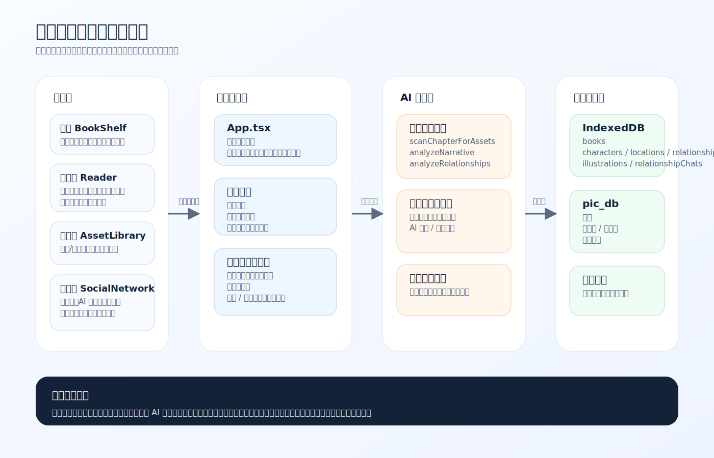
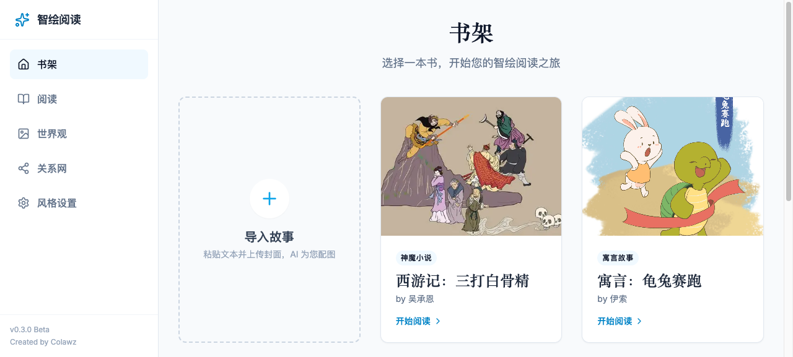
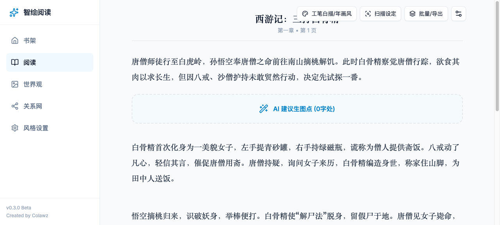
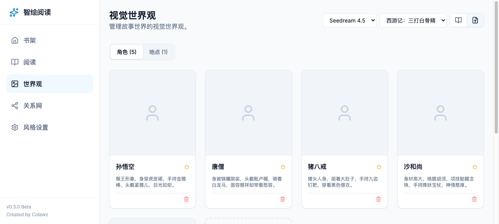
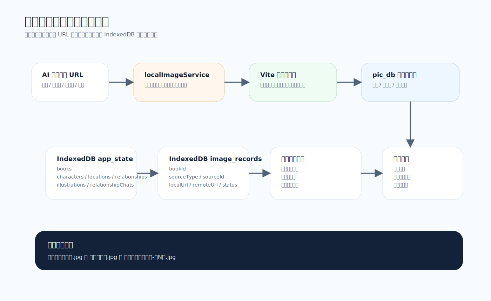
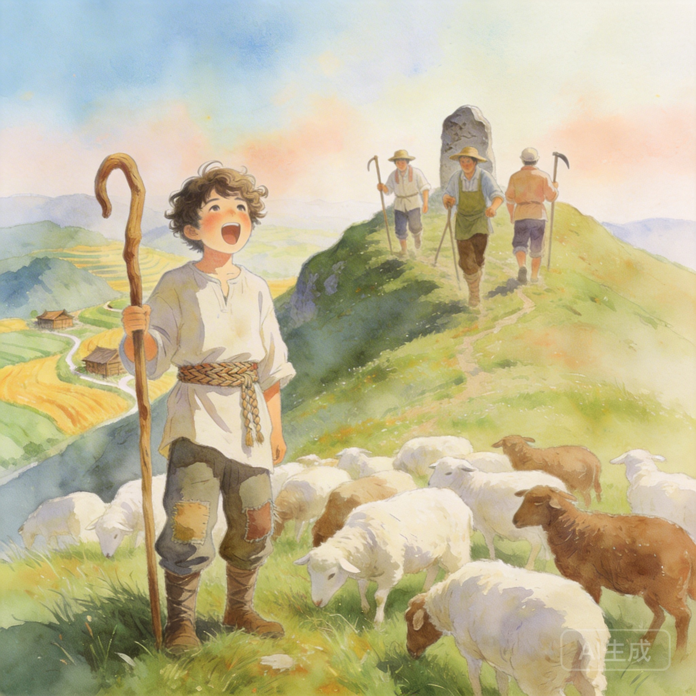

# 智绘阅读项目计划书

版本：2026-04-10  
状态：迭代中

## 1. 项目目标

智绘阅读的目标是构建一套可运行的本地优先型 AI 阅读系统，使用户能够在阅读文本的同时：

- 生成段落插图
- 自动沉淀角色、地点与关系数据
- 形成持续复用的视觉世界观
- 在关系页继续进行阅读理解、关系分析与角色扮演对话

当前项目重点已从“验证能否生图”转向“验证完整阅读工作流能否成立”。

图1 项目总体架构图

## 2. 当前版本完成情况

### 2.1 已完成模块

- 书架与导入系统
- AI 生成封面
- 阅读器单段生图
- 批量生图并发队列
- 章节扫描角色、地点、关系
- 世界观资产库
- 角色关系图
- AI 基于阅读进度生成关系图
- AI 伴读与角色扮演对话
- 聊天记录按书籍持久化
- 本地图片落盘到 `pic_db/`
- IndexedDB 状态持久化
- HTML / PDF 导出

### 2.2 当前核心界面

图2 书架页

图3 阅读器页

图4 世界观页

## 3. 当前真实能力边界

### 3.1 阅读器

- 支持单段生图
- 支持同页多个段落并行生图
- 支持本张额外要求
- 支持重生成和删除
- 支持批量生图

### 3.2 世界观系统

- 扫描后可建立角色、地点资产
- 自动生成角色设定图与地点图
- 支持重生成
- 支持删除
- 支持本地图片归档和恢复索引

### 3.3 关系系统

- 支持手工新增、修改、删除关系
- 支持根据“最后一个已生图章节”自动生成当前阶段关系图
- 关系图会提示：这是到某一章节为止的关系图

### 3.4 AI 聊天系统

- 支持 AI 伴读模式
- 支持扮演书中角色模式
- 角色模式只知道当前阅读进度之前的剧情
- 回复显示角色头像或机器人头像
- 支持清空对话

## 4. 数据与图片计划

当前项目采用双存储方案：

1. `IndexedDB`
   - 存业务状态
   - 存图片记录
   - 存聊天记录
2. `pic_db/`
   - 存本地封面
   - 存角色图
   - 存地点图
   - 存章节插图

当前 `pic_db/` 中已经形成较丰富的数据样本，可直接用于展示、文档与答辩材料。

图5 本地存储与同步机制图

### 4.1 当前样本示例

图6 小红帽封面

图7 小红帽角色

图8 狼来了插图

图9 龟兔赛跑插图

## 5. 下一阶段计划

### 5.1 近期计划

- 继续优化关系页聊天体验
- 优化角色识别与关系抽取精度
- 继续补充书籍样例与图片资产
- 完善文档与展示材料

### 5.2 中期计划

- 支持更精细的章节切分
- 增加书籍级别任务面板
- 增加更完整的阅读进度管理
- 优化移动端适配和 APK 迁移方案

### 5.3 长期计划

- 引入后端代理层
- 隐藏模型密钥
- 研究多端同步
- 支持更强的资产编辑和版本管理

## 6. 风险与应对

### 6.1 当前风险

- 前端直连模型接口，安全性不足
- 角色识别仍有误判可能
- 不同模型下的一致性仍依赖提示词与参考图
- 本地图片方案更适合桌面原型阶段

### 6.2 应对方式

- 通过世界观中间层降低角色漂移
- 通过阅读进度限制减少角色聊天剧透
- 通过 `pic_db` 与 IndexedDB 双持久化增强可恢复性
- 通过分阶段迭代，先保证本地原型完整闭环

## 7. 当前阶段结论

当前版本已经完成了项目最关键的产品闭环：  
`导入文本 -> 阅读 -> 生图 -> 建设世界观 -> 生成关系 -> 伴读对话 -> 本地保存 -> 导出`

这意味着项目已经从“单点功能原型”发展为“具备完整阅读工作流的可展示软件作品”。后续迭代重点不再是是否可行，而是体验优化、工程化与展示完善。
