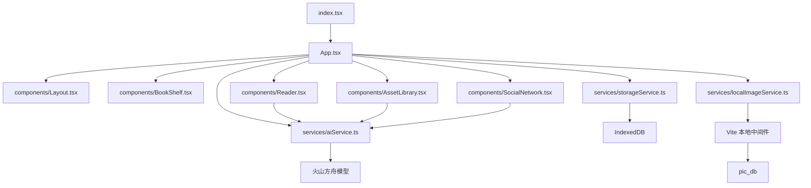
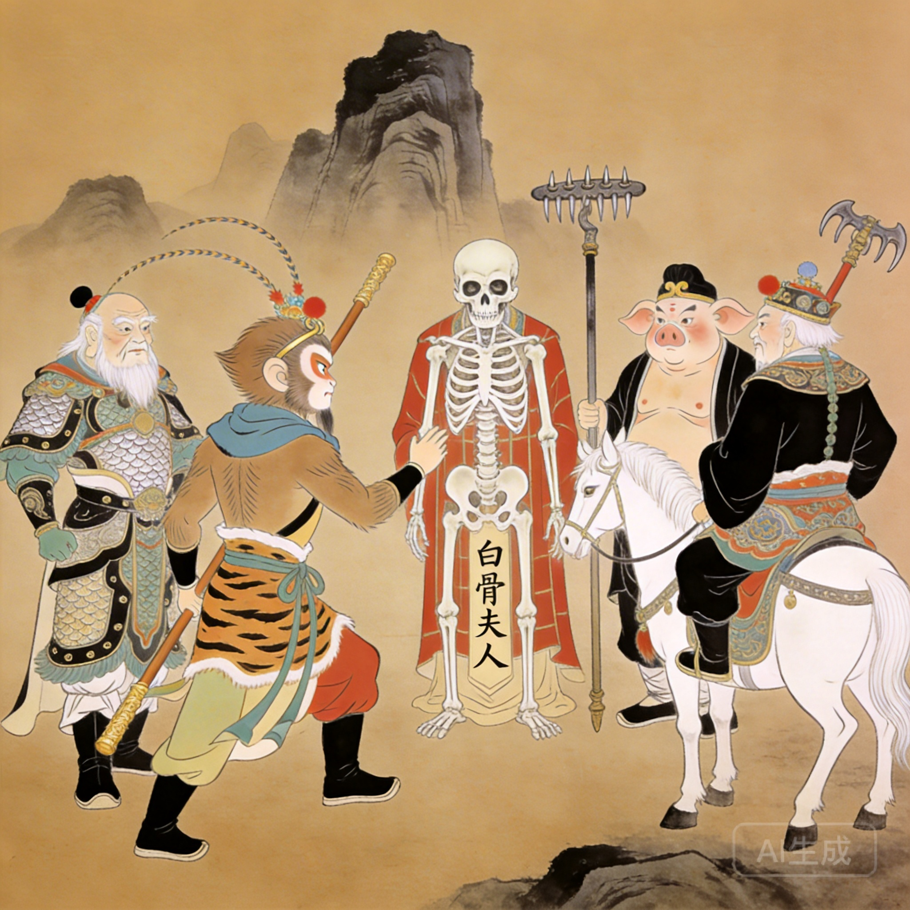
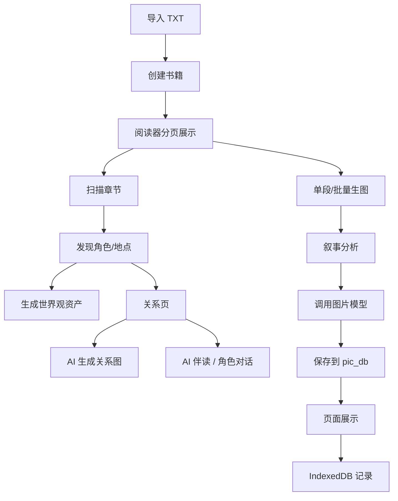

# 智绘阅读开发文档

版本：2026-04-10  
文档属性：项目提交版

## 1. 项目概述

智绘阅读是一套基于 React、TypeScript 与 Vite 构建的本地优先型 AI 阅读系统。系统围绕 `文本导入`、`阅读器生图`、`世界观构建`、`关系生成`、`AI 对话`、`本地图片归档` 与 `图文导出` 七条主线组织实现。

当前版本已经完成从阅读到本地保存的完整链路，适合用作课程项目、软件作品展示和原型验证。


图1 系统总体架构图

## 2. 新应用结构及开发环境设计

### 2.1 当前应用结构



### 2.2 核心模块职责

- `App.tsx`
  - 应用总状态中心
  - 书籍、角色、地点、关系、插图、聊天记录统一调度
- `BookShelf.tsx`
  - 书籍导入
  - 封面上传
  - AI 生成封面
  - 删除书籍
- `Reader.tsx`
  - 正文阅读
  - 单段生图
  - 批量生图
  - 缺失角色补图
  - 设定扫描
- `AssetLibrary.tsx`
  - 世界观资产管理
  - 角色/地点生成状态反馈
  - 资产重生成与删除
- `SocialNetwork.tsx`
  - 关系图展示
  - AI 生成关系图
  - AI 伴读与角色扮演聊天
- `aiService.ts`
  - 文本分析
  - 图片生成
  - 关系分析
  - AI 聊天
- `storageService.ts`
  - IndexedDB 持久化
- `localImageService.ts`
  - 本地图片保存、查找、删除、命名归一化

### 2.3 开发环境设计

开发环境采用“前端 + 本地文件中间件 + 浏览器数据库”的轻量架构：

- 操作系统：macOS
- 运行环境：Node.js 18+
- 前端框架：React 19
- 语言：TypeScript 5
- 构建工具：Vite 6
- 图标库：`lucide-react`

本地环境职责分工：

- `npm run dev`
  - 启动前端页面
  - 启动本地图片中间件
- 浏览器
  - 承载应用界面
  - 保存业务状态到 IndexedDB
- 仓库目录 `pic_db/`
  - 保存真实图片文件

## 3. 作品主要功能的用户界面初始设计图或截图

### 3.1 书架页


图2 书架页截图

书架页用于导入文本、管理封面与选择书籍，是所有工作流的入口。

### 3.2 阅读器页


图3 阅读器页截图

阅读器承担单段生图、批量生图、扫描设定、导出等主流程。

### 3.3 世界观页


图4 世界观页截图

世界观页用于沉淀角色和地点设定，并展示生成状态。

### 3.4 真实角色与插图样例


图5 小红帽角色

图6 妈妈角色

图7 狼角色

图8 狼来了插图

图9 龟兔赛跑插图

图10 三打白骨精插图

## 4. 作品使用的软件和硬件说明

### 4.1 软件环境

- React 19
- TypeScript 5
- Vite 6
- 火山方舟 API
- IndexedDB
- 本地文件系统（通过 Vite 中间件访问）

### 4.2 硬件环境

- Apple Silicon 笔记本电脑
- 16 GB 内存
- 本地磁盘用于保存 `pic_db/` 中的图片资产

### 4.3 简要说明

本项目没有单独部署后端数据库，而是将：

- 业务状态放入 IndexedDB
- 图片文件保存到仓库本地 `pic_db/`

这种设计降低了原型开发复杂度，能够快速支撑完整演示。

## 5. 实现作品主要功能的程序高层设计

### 5.1 高层流程




图11 运行时数据流图

### 5.2 高层设计说明

1. 书架导入层  
负责创建书籍对象，并将封面与文本内容纳入主状态。

2. 阅读器任务层  
负责将单段与批量生图统一到同一任务引擎，包括叙事分析、缺失角色补全、正式出图和状态更新。

3. 世界观层  
负责角色、地点视觉资产的建立、查询和重用，为后续生图提供参考图。

4. 关系层  
负责关系图展示、关系编辑、按阅读进度自动生成关系图。

5. 对话层  
负责伴读聊天与角色扮演聊天，角色模式会读取角色设定、关系与阅读进度。

6. 存储层  
IndexedDB 保存结构化状态，本地 `pic_db/` 保存图片文件，二者共同形成可恢复的本地优先架构。


图12 本地存储同步图

## 6. 作品中主要涉及的共享数据样例

### 6.1 书籍文本样例

- 《小红帽》
- 《狼来了》
- 《寓言：龟兔赛跑》
- 《西游记：三打白骨精》
- 《科普：水循环》

### 6.2 角色图片样例


图13 孙悟空

图14 唐僧

图15 乌龟

图16 兔子

### 6.3 场景图片样例


图17 森林

图18 山坡牧场

图19 白虎岭

### 6.4 本地图片目录样例

```text
pic_db/小红帽/
├── covers/books/封面.jpg
├── assets/characters/小红帽.jpg
├── assets/characters/狼.jpg
├── assets/locations/森林.jpg
└── illustrations/paragraphs/第一章-第13段.jpg
```

## 7. 作品中数据的流转及展示方式

### 7.1 数据流转说明

1. 用户导入文本
2. 书籍进入 `books` 状态
3. 阅读器调用文本模型分析章节或段落
4. 角色、地点、关系进入结构化状态
5. 图片模型生成结果返回远程 URL
6. 系统把图片抓取到本地 `pic_db/`
7. 页面显示本地图片路径
8. 图片记录与业务状态同步写入 IndexedDB

### 7.2 展示方式说明

- 正文与插图：在阅读器中按段落嵌入展示
- 角色与地点：在世界观页按卡片展示
- 关系：在关系页以辐射图和关系详情卡展示
- 聊天：在关系页右侧面板以消息气泡展示

### 7.3 当前消息展示样式特点

- 用户消息使用右侧蓝色气泡
- AI 伴读消息使用机器人头像
- 角色扮演消息使用角色头像
- 聊天记录按书籍保存，刷新后仍可恢复

## 8. 开发结论

当前版本的软件已经从最初的前端 AI 生图演示，发展为具备完整阅读工作流的本地优先型系统。其开发重点不再是单点功能，而是让文本、世界观、关系、对话和本地图片资产形成统一的数据闭环。
