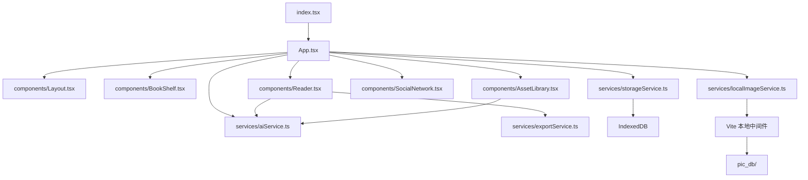
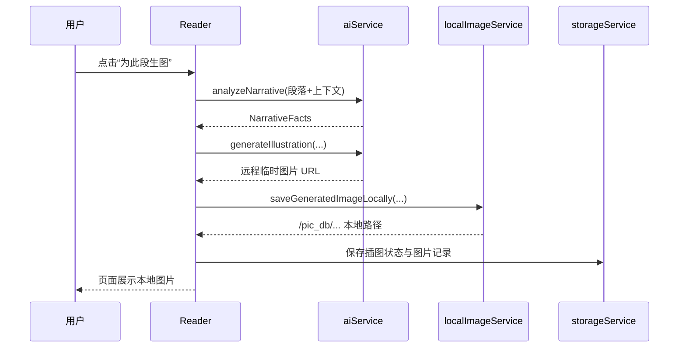

# 智绘阅读开发文档

## 1. 项目概述

“智绘阅读”是一套基于 React、TypeScript 与 Vite 构建的本地优先型 AI 阅读辅助系统。系统围绕“文本导入、叙事信息抽取、世界观构建、插图生成、本地保存与图文导出”这一核心业务链路展开设计与实现。

当前版本的主要特征如下：
- 纯前端单页应用，开发阶段由 Vite 本地服务承载
- 文本理解和生图调用火山方舟模型
- 图片生成后自动下载到仓库本地 `pic_db/`
- 业务状态保存在 IndexedDB，本地图片信息单独入库
- 阅读器、世界观库、关系网、批量生成与导出功能已打通

## 2. 新应用结构及开发环境设计

### 2.1 当前应用结构



### 2.2 目录设计

```text
zhihui-reading/
├── App.tsx                     # 应用主控与状态中心
├── index.tsx                   # 入口
├── constants.ts                # 样例书与风格预设
├── types.ts                    # 核心类型定义
├── components/
│   ├── BookShelf.tsx           # 书架与导入
│   ├── Reader.tsx              # 阅读、生图、批量任务
│   ├── AssetLibrary.tsx        # 角色/地点世界观库
│   ├── SocialNetwork.tsx       # 角色关系图
│   ├── BatchActionsModal.tsx   # 批量生成弹窗
│   └── Layout.tsx              # 主布局
├── services/
│   ├── aiService.ts            # 文本分析与图片生成
│   ├── storageService.ts       # IndexedDB 持久化
│   ├── localImageService.ts    # 本地图片保存/检查/删除
│   └── exportService.ts        # HTML/PDF 导出
├── docs/
│   ├── 开发文档.md
│   └── 测试文档.md
├── pic_db/                     # 本地图片库，按书籍和类型分目录
└── vite.config.ts              # Vite 配置与本地文件中间件
```

### 2.3 开发环境设计

本项目的开发环境采用“前端应用 + 本地文件服务 + 浏览器数据库”的轻量级结构，不依赖独立后端即可完成主要业务验证。

开发机实测环境：
- 操作系统：macOS 26.2
- CPU：Apple M3
- 内存：16 GB
- 架构：`arm64`

软件栈：
- Node.js：建议 20+
- React：19.2.3
- TypeScript：5.8.x
- Vite：6.x
- Tailwind CSS：4.x
- `lucide-react`：图标组件库

环境设计说明：
- `npm run dev` 启动前端页面与本地中间件
- 本地中间件负责：
  - `POST /api/save-generated-image`
  - `DELETE /api/delete-generated-image`
  - `POST /api/check-generated-image`
  - `/pic_db/...` 静态文件访问
- 浏览器 `IndexedDB` 存储应用状态与图片记录
- 仓库 `pic_db/` 落地图片原图，避免临时 URL 过期

## 3. 作品主要功能的用户界面初始设计图（UI Prototype）

以下为当前主界面的结构化原型草图，用于说明布局和交互分区。

### 3.1 书架页

```text
+-------------------------------------------------------------+
| 智绘阅读                                                    |
| [书架] [阅读器] [世界观] [关系图] [设置]                    |
+-------------------------------------------------------------+
| 书籍卡片1     书籍卡片2     书籍卡片3     [+ 导入新书]      |
| 封面/标题      封面/标题      封面/标题      txt/封面上传     |
+-------------------------------------------------------------+
```


### 3.2 阅读器页

```text
+----------------------+--------------------------------------+
| 左侧工具栏           | 章节正文区域                         |
| 扫描资产             | 段落 1                               |
| 批量生图             | [为此段生图]                         |
| 风格/模型选择        | 段落 2                               |
| 导出 HTML / PDF      | [已生成插图] [重生成] [删除]         |
+----------------------+--------------------------------------+
| 页码控制：上一页 / 下一页                                   |
+-------------------------------------------------------------+
```


### 3.3 世界观页

```text
+-------------------------------------------------------------+
| 视觉世界观                                                  |
| [模型选择] [书籍筛选] [导出HTML] [导出PDF]                  |
+-------------------------------------------------------------+
| [角色] [地点]                                               |
+-------------------------------------------------------------+
| 卡片1        卡片2        卡片3        卡片4                |
| 图片/占位     图片/占位     图片/占位     图片/占位           |
| 名称          名称          名称          名称                |
| 状态标签      状态标签      状态标签      状态标签            |
| [重生成]      [重生成]      [重生成]      [重生成]            |
| [删除]        [删除]        [删除]        [删除]              |
+-------------------------------------------------------------+
```


### 3.4 关系图页

```text
+-------------------------------------------------------------+
| 角色关系网                                                  |
+-------------------------------------------------------------+
| 角色节点卡 + 连线关系 + 右侧详情面板                        |
+-------------------------------------------------------------+
```

说明：`pics/` 目录中的图片为书籍封面或外部素材，不作为系统生成结果示例。以下报告中涉及“生成图片”的内容，统一引用 `pic_db/` 中的本地生成文件。

生成内容示例图：


## 4. 作品使用的软件和硬件说明

### 4.1 软件

| 名称 | 用途 | 说明 |
|---|---|---|
| React 19 | 前端 UI 框架 | 负责单页界面渲染与状态驱动更新 |
| TypeScript 5 | 类型系统 | 保证世界观、插图、任务状态等数据结构稳定 |
| Vite 6 | 开发与构建工具 | 提供热更新、本地开发服务与构建输出 |
| Tailwind CSS 4 | 样式系统 | 用于快速搭建界面与状态反馈样式 |
| Fire/Volcengine API | AI 模型服务 | 文本理解与图像生成 |
| IndexedDB | 浏览器本地数据库 | 保存书籍、世界观、插图和图片记录 |
| Git/GitHub | 版本管理 | 管理源码与图片样例 |

### 4.2 硬件

| 设备 | 用途 | 说明 |
|---|---|---|
| 开发机（Apple M3 / 16GB） | 本地开发与测试 | 运行 Vite、浏览器、图片补档流程 |
| 浏览器终端 | 用户运行环境 | Chrome、Edge、Safari 等均可运行 |
| 网络连接 | 调用 AI 接口 | 文本分析与图片生成依赖外部 API |
| 本地磁盘 | 图片落盘 | `pic_db/` 存放生成图片原图 |

## 5. 主要功能高层设计（High Level Design Document）

### 5.1 主要模块职责

| 模块 | 主要职责 |
|---|---|
| `App.tsx` | 管理全局状态、视图切换、持久化、图片记录同步 |
| `Reader.tsx` | 章节阅读、段落分析、单段与批量生图、扫描新资产 |
| `AssetLibrary.tsx` | 维护角色/地点设定与重生成 |
| `SocialNetwork.tsx` | 管理角色关系及可视化展示 |
| `aiService.ts` | 调用文本模型和图片模型，拼装 Prompt 与参考图 |
| `storageService.ts` | 读写 IndexedDB 中的应用主状态和图片记录 |
| `localImageService.ts` | 本地保存、检查、删除 `pic_db` 图片文件 |
| `exportService.ts` | 导出 HTML 和浏览器打印版 PDF |

### 5.2 高层交互设计



阅读生成后的内容表现示意：


### 5.3 新应用结构中的关键设计点

1. 状态中心在 `App.tsx`
   `books / characters / locations / relationships / illustrations / imageGenerationStats` 全部由 `App` 统一管理。

2. AI 与展示解耦
   组件不直接拼接底层请求，只通过 `onGenerateIllustration`、`onGenerateAssetVisual` 与服务交互。

3. 数据双落地
   生成图片后同时落两处：
   - `IndexedDB`：存业务状态与图片记录
   - `pic_db/`：存图片文件原图

4. 批量任务并发控制
   `Reader.tsx` 内部使用并发队列限制同时处理的段落数量，避免浏览器界面被阻塞。

5. 本地图片中间件
   Vite 中间件负责检查、保存、删除本地图片，避免单独搭建服务端。

## 6. 作品中主要涉及的共享数据样例

### 6.1 文本数据样例

来源文件：
- [小红帽.txt](/Users/wangzixing/Desktop/各种软件集合/智绘阅读/zhihui-reading/小红帽.txt)
- [狼来了.txt](/Users/wangzixing/Desktop/各种软件集合/智绘阅读/zhihui-reading/狼来了.txt)
- [constants.ts](/Users/wangzixing/Desktop/各种软件集合/智绘阅读/zhihui-reading/constants.ts) 内置样例书
- [pics](/Users/wangzixing/Desktop/各种软件集合/智绘阅读/zhihui-reading/pics) 目录中的图片仅作为书籍封面素材使用

数据样例：

```ts
{
  id: "book-white-bone-p-0",
  text: "唐僧师徒行至白虎岭，孙悟空奉唐僧之命前往南山摘桃解饥。",
  chapterId: "book-white-bone-ch1"
}
```

### 6.2 世界观数据样例

```ts
{
  id: "char-wukong",
  bookId: "book-white-bone",
  name: "孙悟空",
  visualSummary: "猴王形象，身穿虎皮裙，手持金箍棒",
  imageUrl: "/pic_db/book-white-bone/assets/characters/char-wukong-xxxx.jpg",
  referenceImageUrl: "https://...",
  locked: true,
  generationStatus: "success"
}
```

### 6.3 插图记录样例

```ts
{
  id: "ill-001",
  paragraphId: "book-white-bone-p-4",
  status: "completed",
  imageUrl: "/pic_db/book-white-bone/illustrations/paragraphs/book-white-bone-p-4-xxxx.jpg",
  extractedFacts: {
    characters: ["孙悟空", "白骨精"],
    location: "白虎岭",
    action: "悟空挥棒击打妖精",
    mood: "紧张",
    objects: ["金箍棒"]
  }
}
```

### 6.4 本地图片样例

目录规则：
- `pic_db/<bookId>/assets/characters/`
- `pic_db/<bookId>/assets/locations/`
- `pic_db/<bookId>/illustrations/paragraphs/`

当前样例图片数量与体积：
- 文件数：13
- 目录体积：约 12 MB

示例生成图片：


## 7. 数据流转及展示方式详细说明

### 7.1 书籍导入流

1. 用户在书架页导入 TXT 文本
2. `createBook()` 把文本转为章节和段落结构
3. `App.tsx` 将新书写入 `books`
4. `storageService.ts` 持久化到 IndexedDB
5. UI 跳转到阅读器

### 7.2 扫描世界观流

1. 阅读器触发 `scanChapterForAssets()`
2. AI 返回潜在角色和地点
3. 用户确认后建立角色/地点条目
4. 角色/地点图片生成后先拿到远程 URL
5. `localImageService.ts` 下载并保存到 `pic_db`
6. `App.tsx` 更新 `imageUrl` 和 `referenceImageUrl`
7. `storageService.ts` 把状态和图片记录写入 IndexedDB
8. 世界观页显示卡片与生成状态

### 7.3 段落生图流

1. 用户点击某段落“为此段生图”
2. `Reader.tsx` 提取上下文并调用 `analyzeNarrative()`
3. 若缺失角色形象，进入补全流程
4. 调用 `generateIllustration()` 获取远程图片 URL
5. 调用 `/api/save-generated-image` 将图片落盘到 `pic_db`
6. 更新 `illustrations[paragraphId]`
7. 页面展示 ``
8. 导出时直接读取本地路径渲染

### 7.4 展示方式

| 数据类型 | 展示位置 | 展示方式 |
|---|---|---|
| 书籍 | 书架页 | 卡片列表 |
| 段落 | 阅读器 | 文本分段分页 |
| 插图 | 阅读器段落下方 | 本地图片嵌入，支持重生成与删除 |
| 角色/地点 | 世界观页 | 卡片网格，显示状态标签 |
| 关系 | 关系图页 | 节点 + 连线 |
| 生图统计 | 设置页 | 指标卡与模型维度统计 |

补充的生成展示样例：


### 7.5 数据一致性策略

- 业务状态由 React 状态树维护
- 持久化采用 IndexedDB，刷新页面不丢失
- 图片文件独立落盘到 `pic_db/`
- 启动时进行“图片补档”：
  - 若数据库有记录但本地文件缺失，则尝试重新补存
  - 若历史记录仍是远程 URL，则补写成本地路径

## 8. 当前开发结论

当前版本已经形成完整的本地优先架构：
- 前端负责交互与任务编排
- AI 服务负责语义理解和图片生成
- IndexedDB 负责状态持久化
- `pic_db/` 负责图片文件长期保存

这使项目具备了继续扩展到“本地离线阅读 + 长期图片归档 + 后续服务化迁移”的基础。
