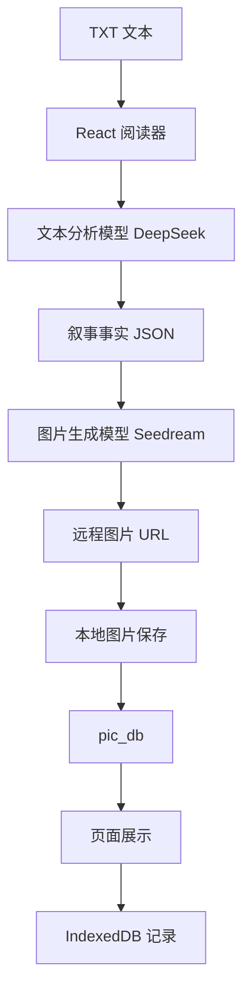

# 智绘阅读技术研究报告


## 1. 研究背景

随着大语言模型与图像生成模型能力的持续提升，文本内容的视觉化呈现已成为数字阅读方向的重要研究与应用议题。传统阅读产品在“语义理解”与“视觉生成”之间仍存在明显割裂：文本平台主要管理文字内容，图像平台主要服务于图像创作，而两者之间缺少面向长文本叙事的中间组织层。


“智绘阅读”围绕上述问题展开技术研究，重点关注以下几个方面：
- 如何从长文本段落中自动抽取可用于绘图的叙事事实
- 如何在多次生图过程中尽量保持角色和场景一致
- 如何在不依赖完整后端系统的前提下，完成本地持久化和图片归档
- 如何将上述能力以低门槛交互整合到阅读器中

## 2. 技术研究目标

本项目的技术研究目标如下：

1. 构建一条从文本到插图的完整处理链路  
   即“文本解析 -> 叙事分析 -> 生图 -> 本地保存 -> 页面展示 -> 数据库存储”。

2. 研究世界观中间层在一致性控制中的作用  
   通过角色、地点和参考图的组合方式降低形象漂移。

3. 研究本地优先架构在 AI 阅读原型中的可行性  
   验证在没有独立服务端的情况下，是否仍可实现较完整的业务闭环。

4. 研究并发任务与状态反馈的可操作方案  
   使系统在单段与批量生图场景下保持可用性和可解释性。

### 2.1 研究问题拆解

围绕上述目标，本项目进一步拆解出以下技术研究问题：
- 如何让大模型输出适合程序直接消费的结构化结果
- 如何在不训练专属模型的条件下提升角色一致性
- 如何在浏览器环境中完成“状态持久化 + 图片长期保存”
- 如何兼顾并发效率与用户可理解的任务反馈

## 3. 技术路线

### 3.1 总体技术路线

本项目采用“前端主控 + 外部 AI 服务 + 浏览器数据库 + 本地文件落盘”的组合方案。



### 3.2 核心研究模块

| 模块 | 研究重点 |
|---|---|
| 文本分析 | 如何从上下文中提取角色、地点、动作、氛围、物体等绘图事实 |
| 世界观抽取 | 如何从章节中发现新角色与新地点 |
| 一致性控制 | 如何利用参考图与视觉摘要提升角色稳定性 |
| 本地存储 | 如何将业务状态和图片结果长期保存 |
| 并发调度 | 如何在批量生成与多段并行场景中控制任务状态 |

### 3.3 技术选型比较

| 研究点 | 备选方案 | 当前采用方案 | 选择原因 |
|---|---|---|---|
| 前端框架 | Vue / React | React 19 | 组件生态成熟，状态驱动清晰 |
| 本地持久化 | localStorage / IndexedDB | IndexedDB | 更适合结构化数据与较大规模状态 |
| 图片保存 | 仅存远程 URL / Base64 / 本地文件 | 本地文件 + DB 元信息 | 兼顾长期可用性与浏览器存储压力 |
| 一致性控制 | 微调模型 / LoRA / 参考图 | 参考图 + 世界观 | 成本更低，适合原型阶段 |
| 并发策略 | 全串行 / 全并行 / 队列并发 | 队列并发 | 效率与稳定性更平衡 |

## 4. 关键技术研究内容

### 4.1 文本叙事分析研究

项目使用火山方舟的 DeepSeek 模型执行文本分析，核心思路是把非结构化文学文本转换为结构化叙事数据。

当前输出的核心结构为：

```ts
interface NarrativeFacts {
  characters: string[];
  location: string;
  action: string;
  mood: string;
  objects: string[];
}
```

研究重点：
- 如何在有限上下文窗口中保持对当前段落的理解
- 如何利用已知角色/地点清单降低幻觉输出
- 如何将自然语言稳定约束成 JSON 结构

当前策略：
- 给模型注入当前段落、上下文片段和已知世界观
- 要求模型严格输出 JSON
- 若解析失败，则使用兜底默认值，避免页面任务链断裂

结论：
- 对小说、寓言、科普等短中篇文本，结构化提取已具备可用性
- 角色/地点误判仍然存在，需要继续优化提示词和匹配逻辑

### 4.2 世界观抽取研究

系统通过 `scanChapterForAssets()` 对章节进行扫描，从文本中发现潜在的新角色与地点。

研究问题：
- 如何在不建立复杂知识图谱的情况下完成轻量世界观发现
- 如何避免重复发现已有角色
- 如何让“扫描结果”与“正式设定”之间有人工确认步骤

当前方案：
- 扫描时先返回候选角色和地点
- 前端根据名称去重
- 用户确认后再正式写入世界观库

这种方案的优点是实现成本低，适合原型验证；缺点是命名变化和误判仍需人工干预。


### 4.3 一致性控制研究

角色一致性是 AI 叙事生图中的核心难题。项目没有采用专门微调模型，而是采用“参考图 + 视觉摘要 + 世界观条目”的轻量中间层方案。

技术思路：
- 每个角色和地点拥有 `visualSummary`
- 已生成的资产图保存在 `imageUrl`
- 原始远程图链接保留在 `referenceImageUrl`
- 生成新段落插图时，将命中的角色图和地点图作为参考图传给图片模型

研究意义：
- 避免完全依赖当前 Prompt 描述
- 让生成过程具备“从既有视觉资料中检索”的能力
- 在不训练私有模型的前提下改善跨章节一致性

当前效果：
- 对主角和高频地点的一致性改善明显
- 对名字含糊、称谓变化多的角色，匹配仍可能不稳定

说明：`pics/` 目录中的图片为书籍封面或外部素材，不作为系统生成结果示例。以下报告中涉及“生成内容”的图片，统一引用 `pic_db/` 中的本地生成文件。

角色与场景样例图：


### 4.4 图片生成研究

项目当前接入两个火山图片模型：
- `doubao-seedream-4-5-251128`
- `doubao-seedream-5-0-260128`

研究内容包括：
- 文生图和参考图生图的统一接口设计
- 16:9 插图与 1:1 资产图的分辨率策略
- 模型切换能力与统计记录

当前策略：
- 阅读器插图使用 16:9
- 角色/地点设定图使用 1:1
- 参考图存在时通过 `image` 字段传入模型
- 每次生成记录模型维度的统计信息

研究结论：
- 模型切换能力提升了系统的可实验性
- 参考图生图对稳定角色外观具有实际帮助
- 在面向原型验证的阶段，显式模型选择比完全黑盒更有利于观察效果差异

不同内容风格下的生成样例：


### 4.5 本地持久化研究

项目针对“远程 URL 临时有效”的问题，研究了前端场景下的双持久化方案：

1. 业务状态入库  
   使用 IndexedDB 保存：
   - `app_state`
   - `image_records`

2. 图片文件落盘  
   使用本地中间件把生成图片下载到仓库目录：
   - `pic_db/<bookId>/assets/characters`
   - `pic_db/<bookId>/assets/locations`
   - `pic_db/<bookId>/illustrations/paragraphs`

该方案解决了两个关键问题：
- 刷新页面后状态不丢失
- 图片不再依赖临时远程地址

本地持久化后的图像样例：


### 4.6 历史图片补档研究

由于项目在演进过程中存在“早期只保存 URL、后期改为本地落盘”的阶段差异，系统进一步增加了启动补档逻辑。

研究内容：
- 如何识别历史记录里哪些图片还只是远程 URL
- 如何识别 `pic_db` 路径存在但本地文件缺失的情况
- 如何在应用启动时自动修复这些历史数据

当前实现：
- 启动时检查 `characters / locations / illustrations`
- 若检测到仍为远程 URL，则重新保存到本地
- 若本地文件缺失且有远程来源，则尝试补档

该机制使系统在持续开发过程中具备了较强的数据迁移与兼容能力。

### 4.7 图片记录数据库研究

随着图片本地化需求增强，项目把图片信息从单纯的业务状态中进一步抽离，建立了独立的 `image_records` 存储。

该研究点的意义在于：
- 图片作为资源对象，可独立统计和管理
- 可与角色、地点、插图三类来源建立映射关系
- 为后续容量治理、图片检索和清理策略提供基础

当前记录内容包括：
- `bookId`
- `sourceType`
- `sourceId`
- `localUrl`
- `remoteUrl`
- `status`
- `createdAt`
- `updatedAt`

本地归档后的内容样例：


## 5. 并发与任务调度研究

### 5.1 单段并行生图

项目早期只能串行处理单段生图，后续改为允许不同段落并行执行。

研究要点：
- 同一段任务必须防重复点击
- 不同段任务允许并行
- 缺失角色时要有排队机制，不能让弹窗互相覆盖

当前实现：
- 使用 `activeGenerationMap` 记录段落级任务状态
- 缺失角色弹窗使用队列处理

### 5.2 批量生图队列

批量任务采用阶段式并发队列，而不是简单循环。

阶段如下：
1. 分析段落
2. 汇总缺失角色
3. 并发补齐角色形象
4. 并发生成插图

研究结论：
- 阶段式并发比完全串行更高效
- 相比完全放开并发，它更适合浏览器环境
- 用户对阶段性反馈敏感，因此需要明确显示“分析中 / 补图中 / 生成中”

## 6. 技术实现分析

### 6.1 前端框架与工程选择

项目采用 React + TypeScript + Vite，原因如下：
- React 适合构建复杂状态驱动的单页应用
- TypeScript 适合描述世界观、插图、任务状态等复杂数据模型
- Vite 启动快，且便于在开发阶段挂载本地文件中间件

### 6.2 服务层设计

当前 `aiService.ts` 负责：
- 文本模型调用
- 图片模型调用
- Prompt 构建
- 参考图注入

这样做的优点是业务调用简单；缺点是服务层已经包含较强业务语义，后续若继续扩展，建议拆分为：
- `narrativeAnalysisService`
- `imageGenerationService`
- `promptBuilder`

### 6.3 存储层设计

当前存储分两层：
- `storageService.ts`：IndexedDB
- `localImageService.ts`：本地文件操作

这一结构的优点在于：
- 可读性较强
- 易于定位问题
- 适合无后端的小型原型

缺点在于：
- 仍依赖 Vite 本地服务环境
- 浏览器端无法直接完成任意磁盘操作，因此这一方案更适合开发机或本地桌面环境

### 6.4 技术路线可行性分析

当前技术路线的可行性主要体现在：
- 前端、AI 服务、本地文件、数据库之间已经形成完整可运行闭环
- 所有核心能力都可在普通开发机环境下复现
- 无需搭建复杂后端即可完成原型验证

但它也有明显边界：
- 更适合本地单机使用，不适合直接作为公网生产架构
- 安全性、权限控制、多端同步等问题仍未展开
- 随着图片数量增大，本地存储治理会变得更重要

生成结果兼容性示例：


## 7. 技术难点与解决方法

### 7.1 难点一：角色一致性

问题：
- 同一角色多次生成时容易发生形象漂移

解决方法：
- 引入角色视觉摘要
- 给角色建立设定图
- 将已有图片作为参考图传给模型

### 7.2 难点二：图片链接失效

问题：
- 图片模型返回的 URL 非永久有效

解决方法：
- 生成后立刻下载原图
- 将图片落盘到 `pic_db`
- 页面优先读取本地路径

### 7.3 难点三：批量并发状态混乱

问题：
- 多段并行、批量并发和缺失角色补图容易造成状态冲突

解决方法：
- 任务引擎统一分析、补图和出图逻辑
- 使用队列和阶段标签保持状态可解释

### 7.4 难点四：历史数据迁移

问题：
- 早期数据与后期数据结构不一致

解决方法：
- 增加补档逻辑
- 增加独立图片记录表
- 启动时自动修复历史记录

### 7.5 难点五：前端状态膨胀

问题：
- 全局状态集中在 `App.tsx`
- 数据项增多后，维护和持久化复杂度持续上升

解决方法：
- 通过服务层与数据层拆分职责
- 用独立 `image_records` 减少图片信息和主状态的耦合
- 后续计划继续抽出任务引擎和 repository 层

## 8. 技术性能研究结论

基于当前实现与实测构建结果，可以得到以下结论：
- 前端包体较小，构建时间短，适合原型快速迭代
- 真正的性能瓶颈主要集中在 AI 图片生成与图片下载链路
- IndexedDB 保存元信息、本地目录保存原图的方案，较好平衡了浏览器存储压力与长期可用性
- 并发队列可以在提升效率的同时维持可控状态

当前仍需重点关注：
- 长篇文本下的分页与任务规模管理
- 大量图片下的本地容量治理
- 更细粒度的耗时统计与自动化测试体系

### 8.1 技术风险分析

1. 外部模型服务风险  
   模型接口、价格、限流策略都可能变化，影响系统稳定性。

2. 本地磁盘增长风险  
   长期使用下 `pic_db` 体积会持续增长，需要清理策略。

3. 浏览器端持久化边界风险  
   IndexedDB 可靠但并非无限容量，且不同浏览器行为存在差异。

4. 架构演进风险  
   当前方案适合原型，但若需求扩大，必须进一步模块化与服务化。

图文内容丰富度示例：


另一类内容样例：


## 9. 后续研究方向

1. 更精细的角色与地点识别  
   研究更稳健的实体归一化方法，减少称谓变化导致的误判。

2. 更强的一致性控制  
   可进一步探索 Embedding 检索、角色模板强化、风格锁定等机制。

3. 更稳定的导出机制  
   研究服务端或本地渲染型 PDF 导出，以替代纯浏览器打印模式。

4. 更系统的任务监控  
   引入任务耗时、失败率、磁盘写入量等指标统计。

5. 从原型到产品的技术演进  
   后续可逐步将本地方案扩展为前后端分离架构，以支持多端同步、权限管理与更大规模存储。

## 10. 技术研究总结

本项目的技术研究工作表明，在当前大模型和图像模型能力基础上，完全可以通过较轻量的工程手段，将“文本分析、参考图控制、本地保存、并发调度”整合成一个可运行的智能阅读原型。

其核心价值不在于某一个单点技术，而在于多项技术的协同落地：
- 大模型负责理解
- 图片模型负责生成
- 世界观结构负责组织
- 本地数据库与文件系统负责保存
- 前端任务引擎负责编排

## 11. 结论

本项目的技术研究重点不在于单一模型本身，而在于如何将“文本理解、视觉生成、世界观控制、本地归档、并发调度”组织成一个真实可运行的阅读增强系统。

研究结果表明：
- 利用大语言模型提取叙事事实是可行的
- 利用参考图与世界观中间层改善一致性是可行的
- 在无独立后端条件下完成本地持久化与图片归档也是可行的

因此，“智绘阅读”已经验证了一条具有现实应用价值的技术路线：  
即通过轻量化、本地优先的系统架构，将 AI 理解能力与 AI 生成能力嵌入数字阅读流程之中，为后续构建更完整的智能阅读系统奠定基础。
