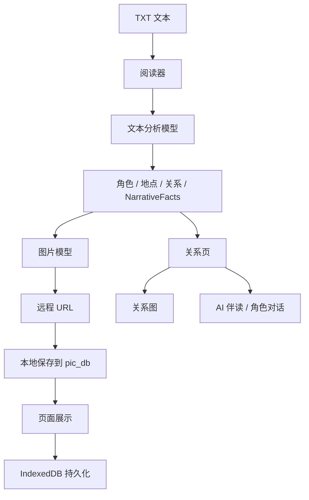
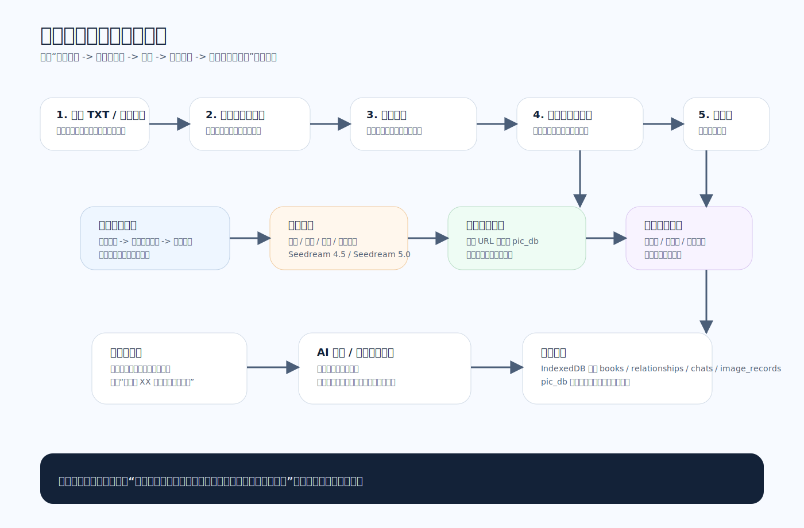
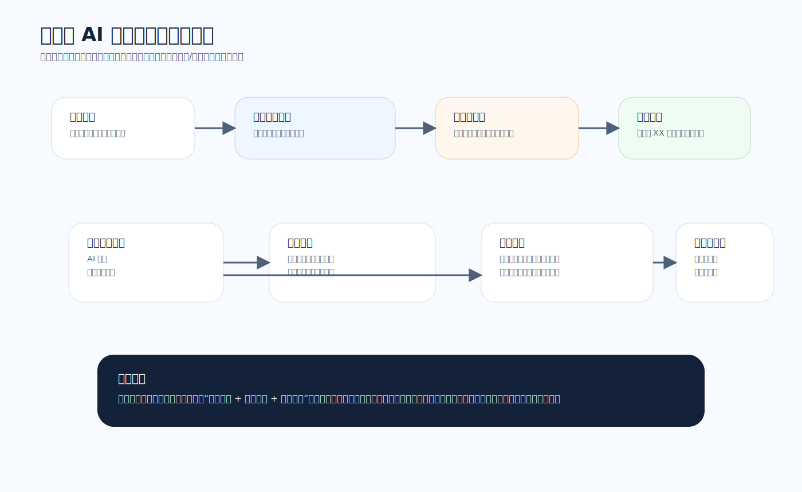

# 智绘阅读技术研究报告

版本：2026-04-10  
文档属性：项目提交版

## 1. 研究背景

在传统电子阅读产品中，文字、图像、人物关系和互动式理解通常是割裂的。小说平台偏重文本承载，绘图工具偏重图像生成，而角色关系和阅读问答又常常需要用户自行整理。本项目希望验证一条新的技术路线：是否可以将 `阅读理解`、`图片生成`、`世界观沉淀`、`关系构建` 与 `伴读对话` 放到同一套本地优先应用中。


图1 阅读器界面


图2 系统总体架构图

## 2. 研究目标

本项目围绕以下技术目标展开：

1. 从文本中抽取适合绘图的结构化事实  
2. 在多次生图中尽量维持角色与场景一致性  
3. 在无独立后端的前提下完成本地长期保存  
4. 让关系生成与角色聊天能够依赖当前阅读进度  
5. 形成“可读、可图、可存、可问”的闭环

## 3. 技术路线

### 3.1 总体路线




图3 运行时数据流图

### 3.2 当前选型

| 技术点 | 当前方案 | 说明 |
|---|---|---|
| 前端框架 | React 19 | 组件化与状态驱动适合当前原型 |
| 文本分析 | DeepSeek | 用于章节扫描、叙事分析 |
| 图片模型 | Seedream 4.5 / 5.0 | 用于封面、资产图、段落插图 |
| 关系与聊天 | doubao-seed-2-0-pro-260215 | 用于关系页阅读理解与对话 |
| 状态存储 | IndexedDB | 存状态、图片记录、聊天记录 |
| 图片长期保存 | 本地 `pic_db/` | 避免临时 URL 失效 |

## 4. 关键技术研究内容

### 4.1 叙事事实抽取

阅读器生图前，会先把段落转换为统一结构：

```ts
interface NarrativeFacts {
  characters: string[];
  location: string;
  action: string;
  mood: string;
  objects: string[];
}
```

研究结论：
- 对短中篇叙事文本，结构化抽取已经足够支撑生图
- 结合“已知角色 / 已知地点”清单，可以降低误判
- 仍需继续优化角色与地点边界判断

### 4.2 世界观中间层

本项目没有直接把每次生图当成独立任务，而是引入“世界观中间层”：

- 角色卡
- 地点卡
- 关系
- 参考图

这样做的研究价值在于：
- 后续插图可以复用角色设定图
- 相同角色在不同段落中的视觉差异明显减小
- 关系页与聊天页也能复用这些结构化信息

### 4.3 图片长期保存研究

早期版本仅保存远程图片 URL，但远程 URL 有过期风险。当前方案演进为：

1. 图片生成后先拿到远程 URL
2. 本地中间件立即将图片下载到 `pic_db/`
3. 页面展示优先使用本地路径
4. IndexedDB 保存图片记录和业务状态

这一方案的意义在于：
- 历史结果可长期访问
- 刷新页面后仍可恢复
- 文档和答辩材料可以直接复用本地图像

### 4.4 文件命名归一化研究

当前项目已经把 `pic_db/` 中的文件命名改为可读形式：

- 资产图：`资产名.jpg`
- 章节插图：`章节名-第N段.jpg`
- 封面：`封面.jpg`

例如：


图4 小红帽封面

图5 狼来了插图

研究结论：
- 可读命名显著提升了调试、展示和文档维护效率
- 文件重命名后需要同步更新页面索引恢复逻辑


图6 本地存储与同步机制图

### 4.5 关系页 AI 化研究

关系页原本只支持手工编辑，现在已经演进为：

- 基于当前阅读进度自动生成关系图
- AI 伴读聊天
- 扮演书中角色聊天

这里的核心研究点是“如何限制角色知道的剧情范围”。当前做法是：

- 自动计算“最后一个已生图章节”
- 只把该章节之前的正文提供给角色模式
- 提示词中明确禁止角色知道后文


图7 关系页 AI 流程图

### 4.6 聊天持久化研究

当前聊天记录按书籍保存到 IndexedDB。消息除文本外，还保存：

- 消息角色：用户 / 助手
- 助手模式：伴读 / 角色
- 对应角色 ID

这使得：
- 刷新后仍可恢复对话
- 历史消息可以显示正确头像
- 切换角色后旧消息不会串身份

## 5. 技术难点与解决方式

### 5.1 角色一致性问题

难点：
- 通用生图模型对长篇角色的一致性天然较弱

解决方式：
- 先生成角色设定图
- 再将设定图作为后续段落插图的参考图
- 对角色设定做本地长期保存

### 5.2 本地图片与前端索引问题

难点：
- 图片文件名变化后，前端旧路径会失效

解决方式：
- 启动时执行图片索引恢复
- 支持查找本地图片、归一化命名、迁移旧路径
- 页面优先显示本地路径

### 5.3 角色聊天剧透问题

难点：
- 若给角色整本书正文，角色会知道后续剧情

解决方式：
- 将角色模式正文截断到当前阅读进度
- 在提示词中要求超出范围时明确表示“不知道”

### 5.4 并发任务体验问题

难点：
- 单段和批量任务混合时，容易出现状态混乱

解决方式：
- 将单段和批量生图统一到任务引擎
- 批量任务按顺序分批，每批最多并发 3 张
- 对缺失角色、待处理任务和批量阶段提供状态提示

## 6. 当前样例数据与效果

### 6.1 角色设定样例


图8 孙悟空

图9 白骨精

图10 小红帽

图11 猎人

### 6.2 插图样例


图12 三打白骨精插图

图13 狼来了插图

图14 龟兔赛跑插图

图15 水循环插图

## 7. 研究结论

本项目表明：在不引入完整后端系统的情况下，仅依靠前端、浏览器数据库、本地图片目录和外部模型接口，也可以构建一套完整的多模态阅读原型。当前版本最有价值的技术结论有三点：

1. 世界观中间层对一致性控制是有效的  
2. 本地图片归档是阅读类 AI 应用长期可用的关键  
3. 关系图与角色聊天必须结合“阅读进度”才能真正符合叙事逻辑

因此，智绘阅读已不再只是生图原型，而是一套具备持续扩展潜力的阅读技术实验平台。
