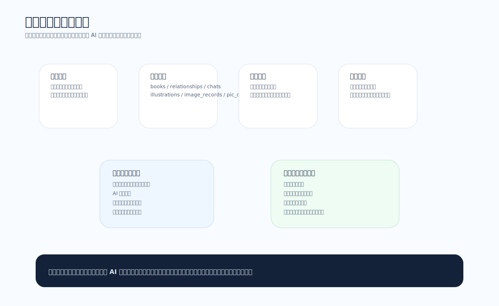

# 智绘阅读测试文档

版本：2026-04-10  
文档属性：项目提交版

## 1. 测试目标

本测试文档用于说明智绘阅读当前版本在以下方面的可用性：

- 阅读与生图流程是否正确
- 世界观与关系数据是否能正常沉淀
- 本地图片是否能正确落盘并恢复索引
- AI 聊天与角色扮演是否符合当前阅读进度
- 系统在本地环境下的性能与数据流量特征

## 2. 测试环境

### 2.1 硬件环境

- Apple Silicon 开发机
- 16 GB 内存
- 本地磁盘用于保存 `pic_db/`

### 2.2 软件环境

- macOS
- Node.js 18+
- npm
- React 19
- Vite 6
- Chrome / Safari 现代浏览器

### 2.3 测试数据

- 内置书籍：
  - 《西游记：三打白骨精》
  - 《寓言：龟兔赛跑》
  - 《科普：水循环》
- 外部导入书籍：
  - 《小红帽》
  - 《狼来了》
- 本地图片库：
  - `pic_db/`

### 2.4 当前测试图像样例


图1 小红帽角色图

图2 狼来了插图

图3 龟兔赛跑插图


图4 测试覆盖范围图

## 3. 测试范围

### 3.1 功能测试范围

- 书籍导入
- 封面上传与 AI 生成封面
- 单段生图
- 批量生图
- 缺失角色补图
- 世界观资产生成、重生成、删除
- 关系图生成
- AI 伴读与角色扮演聊天
- 聊天记录持久化
- 导出

### 3.2 数据测试范围

- `books`
- `characters`
- `locations`
- `relationships`
- `illustrations`
- `relationshipChats`
- `image_records`
- `pic_db/` 本地图片文件

### 3.3 性能测试范围

- 构建体积
- 启动恢复
- 单段生图任务链路
- 批量生图并发执行
- 本地图片保存性能
- 聊天响应等待表现

## 4. 功能测试用例

### 4.1 书籍与封面

| 编号 | 用例 | 预期结果 |
|---|---|---|
| F-01 | 导入 TXT | 新书出现在书架并可进入阅读器 |
| F-02 | 上传封面 | 书架显示上传封面 |
| F-03 | AI 生成封面 | 封面预览更新并保存到本地 |
| F-04 | 删除书籍 | 书籍、相关资产、插图与聊天记录一并清除 |

### 4.2 阅读器与生图

| 编号 | 用例 | 预期结果 |
|---|---|---|
| F-05 | 单段生图 | 段落状态变为生成中，完成后展示插图 |
| F-06 | 多段并行生图 | 不同段落可同时生成 |
| F-07 | 本张额外要求 | 最终 prompt 追加该段要求 |
| F-08 | 重生成 | 旧图替换为新图，本地旧文件被清理 |
| F-09 | 删除插图 | 段落恢复为空状态，本地图同步删除 |

### 4.3 世界观与扫描

| 编号 | 用例 | 预期结果 |
|---|---|---|
| F-10 | 扫描章节 | 能识别新角色与地点 |
| F-11 | 建立设定库 | 自动跳转世界观页并生成资产 |
| F-12 | 资产重生成 | 卡片显示生成状态并回写新图 |
| F-13 | 删除资产 | 世界观卡片消失，本地图同步删除 |

### 4.4 关系图与聊天

| 编号 | 用例 | 预期结果 |
|---|---|---|
| F-14 | AI 生成关系图 | 能生成截至当前阅读进度的关系图 |
| F-15 | 范围提示 | 页面显示“这是到 XX 章节为止的角色关系图” |
| F-16 | AI 伴读聊天 | 能回答剧情、人物与关系问题 |
| F-17 | 角色扮演聊天 | 使用角色头像，并按角色身份回答 |
| F-18 | 角色范围限制 | 超出当前阅读进度的问题会被限制 |
| F-19 | 聊天持久化 | 刷新后仍保留该书对话 |
| F-20 | 清空对话 | 当前书籍对话被清空，仅保留初始提示 |

## 5. 数据一致性测试

### 5.1 应用状态与本地图一致性

重点检查：

- `illustrations[paragraphId].imageUrl`
- `characters[].imageUrl`
- `locations[].imageUrl`
- `books[].coverUrl`
- `pic_db/` 中对应文件是否存在

### 5.2 索引恢复测试

步骤：

1. 启动应用并生成多张图片
2. 关闭页面
3. 重新打开应用
4. 检查：
   - 书架封面是否恢复
   - 世界观页资产图是否恢复
   - 阅读器插图是否恢复

预期：
- 页面优先使用本地 `pic_db/` 路径
- 旧命名或旧路径会被自动归一化

### 5.3 聊天记录持久化测试

步骤：

1. 在关系页选择一本书
2. 以伴读或角色身份连续对话
3. 刷新页面
4. 回到该书关系页

预期：
- 对话记录恢复
- 历史消息头像与角色身份保持一致

## 6. 运行时数据流量及性能分析

### 6.1 运行时主要数据流

```text
文本 -> 文本分析 JSON -> 图片生成 URL -> 下载到 pic_db -> 页面渲染 -> IndexedDB 持久化
                                    ↘ 关系图生成
                                    ↘ AI 伴读 / 角色对话
```


图5 运行时数据流图

### 6.2 网络流量来源

运行时网络流量主要来自三类请求：

1. 文本分析请求
   - 章节扫描
   - 段落叙事分析
   - 关系图生成
   - 聊天问答
2. 图片生成请求
   - 封面
   - 角色图
   - 地点图
   - 段落插图
3. 本地图片抓取请求
   - 将远程 URL 落地到 `pic_db/`

### 6.3 前端构建体积

最近构建结果：

```text
dist/assets/index-CQSruccQ.js  336.74 kB │ gzip: 101.50 kB
```

结论：
- 当前主包体积对于原型项目可接受
- 后续若继续增加文档、面板与状态逻辑，应考虑拆分页面级代码

### 6.4 启动恢复性能

启动时会执行：

- IndexedDB 状态加载
- 本地图片索引恢复
- 旧路径与新命名归一化检查

实际观察：
- 小中型数据集下启动等待可接受
- 由于 `pic_db/` 已经积累较多图片，恢复逻辑是启动性能的重要组成部分

### 6.5 批量生图性能

当前策略：
- 按正文顺序排队
- 每批最多并发 3 张
- 一批完成后再进入下一批

优点：
- 不会无上限并发
- 保证生成顺序与阅读顺序一致
- 状态反馈较清晰

### 6.6 聊天性能

关系页 AI 聊天使用 `doubao-seed-2-0-pro-260215`：

- 伴读模式：使用整本书上下文摘要
- 角色模式：只读取当前阅读进度前的文本

实际表现：
- 角色模式上下文更短，响应更稳定
- 聊天记录持久化开销较小

## 7. 异常测试

### 7.1 图片异常

- 本地图片文件被删除后，页面是否能重新索引
- 重生成后是否删除旧文件
- 文件名归一化后旧路径是否还能恢复

### 7.2 聊天异常

- 网络失败时是否返回错误提示
- 角色模式无阅读进度时是否仍能给出合理提示
- 清空对话后是否正确清理持久化

### 7.3 数据异常

- 删除书籍后是否残留聊天记录
- 删除资产后是否残留无效图片索引
- 删除插图后是否残留旧状态

## 8. 测试结论

当前版本已基本完成以下验证：

- 核心阅读与生图链路可运行
- 本地图片归档与索引恢复可运行
- 关系页 AI 生成功能可运行
- 伴读与角色扮演聊天可运行
- 聊天记录按书籍持久化可运行
- 角色模式能够限制在当前阅读进度之前

结论上，智绘阅读当前已达到“完整原型系统”的测试要求，能够支撑展示、答辩和持续迭代。
