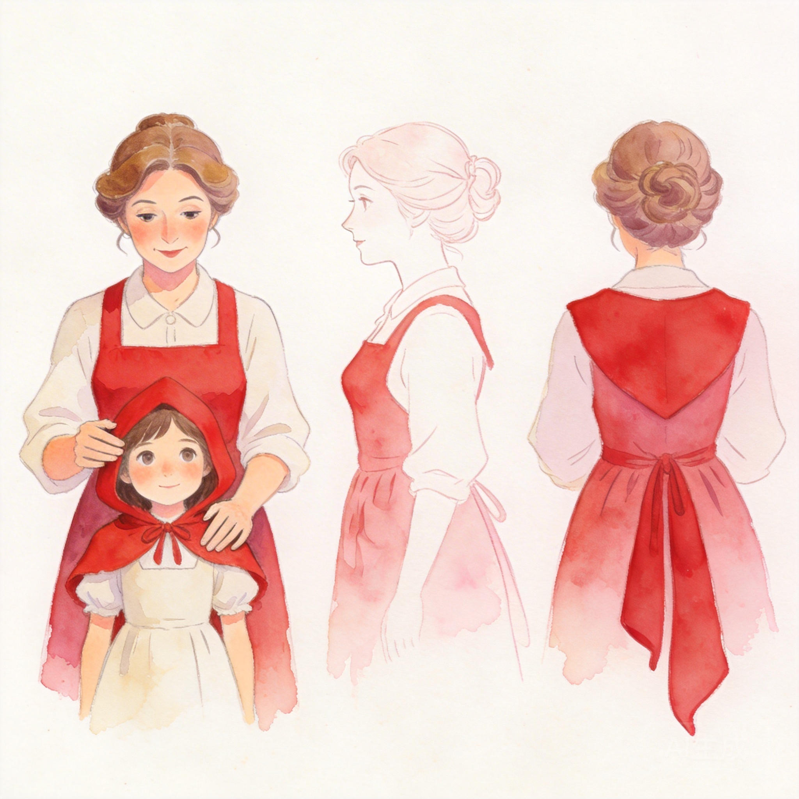

# 智绘阅读设计及创新性分析报告

版本：2026-04-10  
文档属性：项目提交版

## 1. 项目概述

智绘阅读是一款面向文本阅读场景的 AI 图文辅助系统。项目围绕“阅读中的画面感不足、角色一致性不足、关系理解割裂以及图片难以长期保存”等问题展开设计，目标是在一个统一界面中完成：

- 阅读
- 生图
- 设定构建
- 关系整理
- 伴读问答
- 本地图片保存


图1 阅读器主界面


图2 系统总体架构图

## 2. 设计背景

当前阅读类产品普遍存在以下缺口：

- 电子书平台偏重纯文本
- 漫画平台虽然视觉化强，但生产成本高
- 通用 AI 生图工具无法天然理解长文本叙事连续性
- 角色关系和阅读问答通常与正文阅读分离

因此，本项目并不是简单给文字配几张图，而是尝试提出一种“阅读即建模、阅读即沉淀、阅读即可对话”的新型阅读产品结构。

## 3. 设计目标

### 3.1 目标一：让阅读过程本身具备视觉生产能力

读者不应离开正文去操作复杂绘图工具，而应在阅读器中直接完成：

- 为此段生图
- 重生成
- 删除
- 批量生成

### 3.2 目标二：让世界观成为可积累资源

生成的角色、地点和关系不应只是临时中间结果，而应进入可复用的世界观库，作为后续插图和关系分析的基础。

### 3.3 目标三：让关系理解和阅读问答回到作品上下文中

关系网不只是静态图，而应该能继续“读书”、继续“解释”，甚至能让角色在自己的认知边界里说话。

## 4. 总体设计思路

### 4.1 核心结构

本项目的设计采用五层协同：

1. 书架层  
2. 阅读器层  
3. 世界观层  
4. 关系层  
5. 本地存储层

### 4.2 用户阅读路径

```text
导入书籍 -> 阅读正文 -> 扫描设定 -> 生图 -> 形成角色/地点库 -> 构建关系图 -> 继续伴读与角色对话
```


图3 运行时数据流图

### 4.3 设计重点

- 让主要操作尽量发生在阅读语境中
- 让系统自动补全世界观而不是要求用户手工建立全部资产
- 让每一次生成的图片都能长期保存而不是依赖临时 URL

## 5. 创新性分析

### 5.1 创新点一：把阅读器、世界观和关系页打通

很多产品只做其中一个环节：

- 要么是阅读器
- 要么是 AI 生图工具
- 要么是关系图工具

智绘阅读把三者合并在一个流程里，使“读文本 -> 发现角色 -> 建立设定 -> 生成插图 -> 整理关系 -> 继续问答”成为连续动作。

### 5.2 创新点二：世界观中间层而不是单次生图

项目不是每次都直接根据段落临时出图，而是引入：

- 角色设定图
- 地点设定图
- 关系数据
- 参考图复用

这使得系统更像“阅读中的导演工作台”，而不是“随机图片生成器”。

### 5.3 创新点三：关系页继续阅读

关系页现在不只是展示关系图，还具备两项扩展能力：

1. 基于当前阅读进度自动生成关系图  
2. 以伴读或角色身份继续对话

这一点使关系页从“结果页”变成“继续理解文本的工作区”。

### 5.4 创新点四：角色聊天遵守阅读进度

角色扮演聊天并非直接读取整本书，而是只读取到最后一个已生图章节为止的内容。  
这使角色对话更加符合叙事逻辑，也减少了剧透。


图4 关系页 AI 流程图

### 5.5 创新点五：图片本地长期保存

很多原型产品会停留在“远程图片 URL 展示”阶段，但这些链接往往会过期。  
智绘阅读将生成图自动抓取到本地 `pic_db/`，并配合 IndexedDB 做状态恢复，使系统具备长期可展示性。


图5 本地存储同步图

## 6. 真实效果示例

### 6.1 角色设定图


图6 小红帽

图7 妈妈

图8 狼

### 6.2 场景与插图


图9 森林场景

图10 狼来了插图

图11 龟兔赛跑插图

图12 三打白骨精插图

### 6.3 世界观与管理界面


图13 世界观页

## 7. 设计价值分析

### 7.1 对读者的价值

- 减少阅读中的想象负担
- 提高奇幻、神话、科普等题材的画面感
- 让关系理解与角色理解更加直接

### 7.2 对创作者的价值

- 低成本验证角色与场景设计
- 快速形成可展示的图文内容
- 在写作与阅读之间建立更强的视觉反馈

### 7.3 对展示与教学的价值

- 适合将故事或科普内容转为图文展示
- 适合用于答辩、课程展示和作品集演示

## 8. 当前设计局限

- 当前角色一致性仍依赖参考图和提示词，不是训练级约束
- 图片风格统一程度仍受模型波动影响
- 关系图生成与角色聊天主要依赖提示词工程，不是图数据库方案
- 本地图片架构更适合桌面原型阶段

## 9. 结论

智绘阅读当前最有代表性的创新，不是“能生图”本身，而是把阅读、设定、关系、对话和本地保存整合为同一条工作流。它把传统阅读产品中的多个割裂环节重新组织起来，形成了一个更接近“阅读创作台”的系统形态。这种设计使其具备明显的展示价值和继续演进空间。
